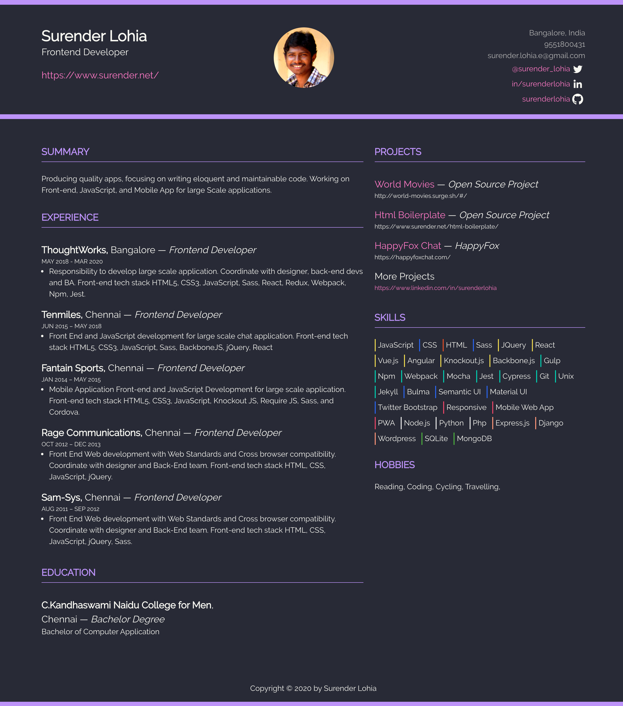

# Resume

💼 Free resume page template with bulma css

## Live Demo

+ Dark Theme: [/resume/](https://surenderlohia.github.io/resume/)

## Feature

+ Hot Module Replacement (HMR) in local development
+ Optimized assets (HTML minified, CSS purge and minified, JS minified)
+ Easy to update content
+ Available in light and dark theme version
+ Mobile friendly interface
+ Lightning speed load time performance

## Screenshoot

|              Dracula Theme          |
| :---------------------------------: |
|  |

## Lighthouse Audit


## Update with your own!

Just go update file [data.js](https://github.com/surenderlohia/resume/blob/master/src/data.js) with your own data.

Below is sample of structure data that you can found in the file:

```javascript
module.exports = {
  profile: {
    name: 'Irfan Maulana',
    title: 'Principal Engineer for Frontend at Tokopedia',
    photo: 'https://avatars2.githubusercontent.com/u/7221389?s=300&v=4', // 300x300px
    city: 'Jakarta, Indonesia',
    phone: '(+62) 857-8123-8798',
    mail: 'mazipanneh@gmail.com'
  },
  social: {
    facebook: {
      name: 'mazipanneh',
      link: 'https://web.facebook.com/mazipanneh'
    },
    twitter: {
      name: '@maz_ipan',
      link: 'https://twitter.com/Maz_Ipan'
    },
    linkedin: {
      name: 'in/mazipan',
      link: 'https://www.linkedin.com/in/mazipan'
    },
    github: {
      name: 'mazipan',
      link: 'https://github.com/mazipan'
    }
  },
  summary: 'summary',
  experiences: [
    {
      company: 'Tokopedia',
      location: 'Jakarta',
      title: 'Principal Engineer for Frontend',
      period: 'JUN 2019 - PRESENT',
      jobdesc: [],
    }
  ],
  educations: [
    {
      name: 'Muhammadiyah University',
      city: 'Jakarta',
      degree: 'Bachelor Degree',
      period: '2009 - 2013',
      faculty: 'Bachelor of Informatics Engineering'
    }
  ],
  projects: [
    {
      title: 'AAAAA',
      company: 'AAAAA',
      period: 'JUL 2018 - JUN 2019'
    }
  ],
  skills: [
    {
      name: 'AAAAA',
      progress: 70
    }
  ],
  languages: []
}
```

-----

Copyright © 2018-2019 by Irfan Maulana
